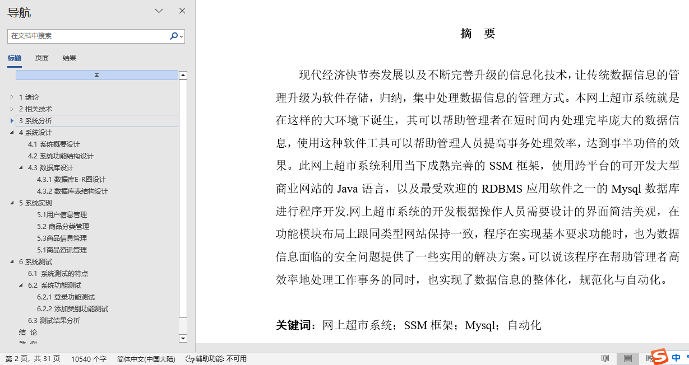
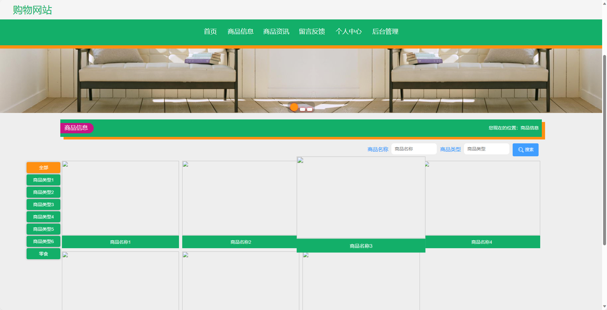
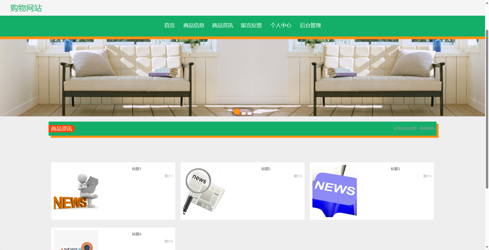
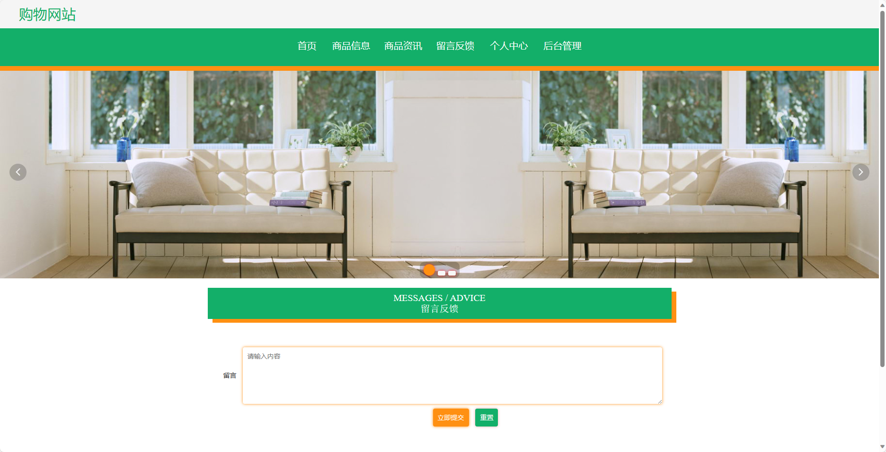
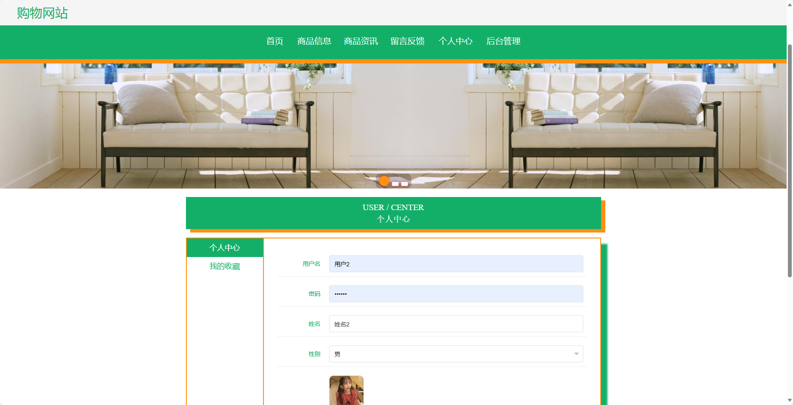
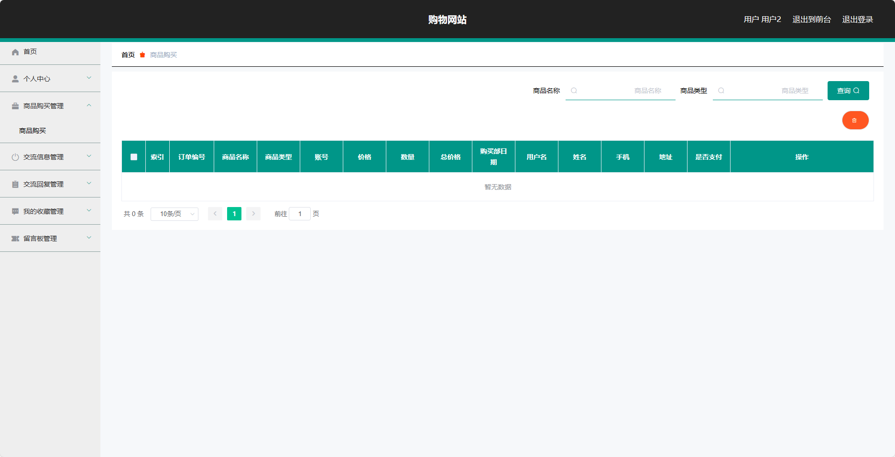
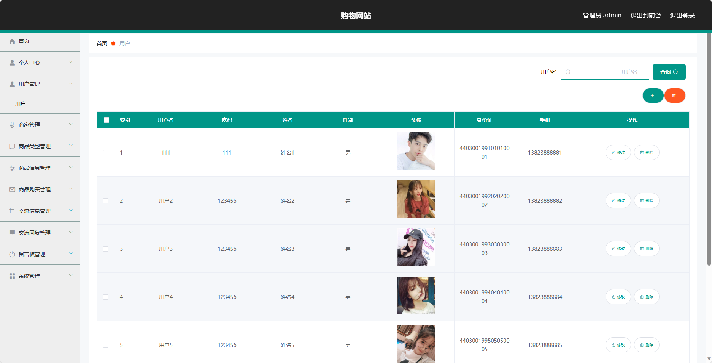
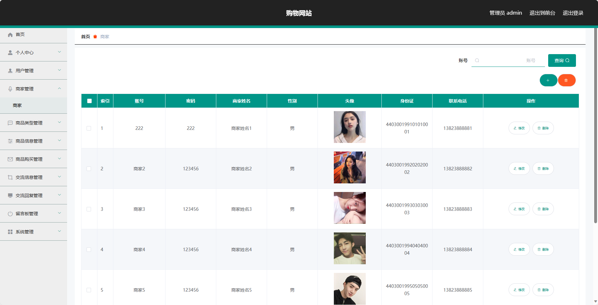
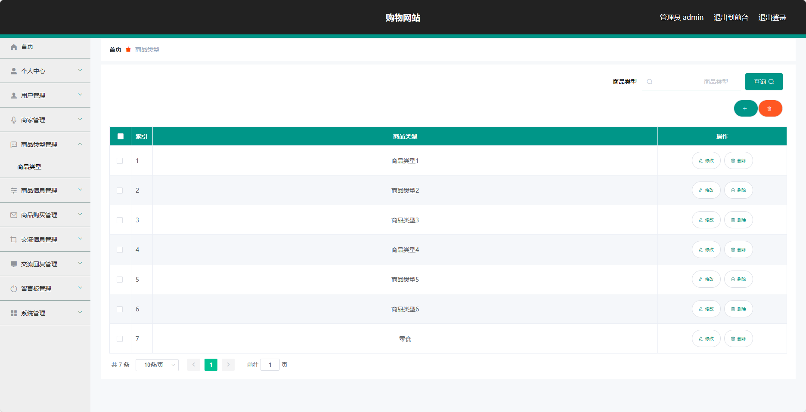
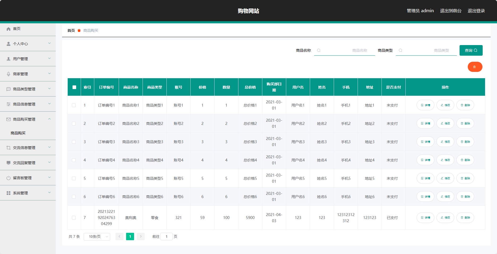

## 基于SSM框架实现的购物网站(程序+报告)

- <b>完整代码获取地址：从戎源码网 ([https://armycodes.com/](https://armycodes.com/))</b>
- <b>技术探讨、资料分享，请加QQ群：692619798</b> 
- <b>作者微信：19941326836  QQ：952045282</b> 
- <b>承接计算机毕业设计、Java毕业设计、Python毕业设计、深度学习、机器学习</b>
- <b>选题+开题报告+任务书+程序定制+安装调试+论文+答辩ppt 一条龙服务</b>
- <b>所有选题地址 ([https://github.com/YuLin-Coder/AllProjectCatalog](https://github.com/YuLin-Coder/AllProjectCatalog)) </b>

## 项目介绍
基于SSM框架实现的购物网站，系统包含两种角色：管理员、用户,系统分为前台和后台两大模块，主要功能如下。
前台功能简介：
1. 首页：展示网站的主要内容和推荐商品，方便用户快速浏览和导航。
2. 商品信息：展示各类商品的详细信息，包括商品图片、价格、描述等，用户可以根据自己的需求进行筛选和查看。
3. 商品资讯：提供商品的最新资讯和促销活动，帮助用户了解商品的优惠信息和购买指南。
4. 留言反馈：提供给用户发表意见和建议的平台，用户可以对商品或网站进行留言反馈，以便改进和优化用户体验。
5. 个人中心：用户可以在个人中心查看和管理自己的个人信息，包括订单、收藏、留言等。

后台功能简介：
1. 个人中心：管理员可以在个人中心查看和管理自己的个人信息，包括修改密码、查看权限等。
2. 用户管理：管理员可以对用户进行管理，包括查看用户信息、禁用用户、重置密码等。
3. 商家管理：管理员可以对商家进行管理，包括审核商家、管理商家信息等。
4. 商品类型管理：管理员可以对商品类型进行管理，包括添加、编辑和删除商品类型。
5. 商品信息管理：管理员可以对商品信息进行管理，包括添加、编辑和删除商品信息。
6. 商品购买管理：管理员可以查看和管理用户的购买记录、订单状态等。
7. 交流信息管理：管理员可以查看和管理用户之间的交流信息，包括留言内容、发布时间等。
8. 交流回复管理：管理员可以对用户的交流信息进行回复和管理，确保用户问题得到及时解答。
9. 留言板管理：管理员可以对留言板进行管理，包括查看留言、删除留言等。
10. 系统管理：管理员可以对系统进行管理，包括设置网站基本信息、备份数据库等。

商家功能简介：
1. 个人中心：商家可以在个人中心查看和管理自己的个人信息，包括修改密码、查看权限等。
2. 商品类型管理：商家可以对商品类型进行管理，包括添加、编辑和删除商品类型。
3. 商品信息管理：商家可以对商品信息进行管理，包括添加、编辑和删除商品信息。
4. 商品购买管理：商家可以查看和管理用户的购买记录、订单状态等。
5. 交流信息管理：商家可以查看和管理用户之间的交流信息，包括留言内容、发布时间等。
6. 交流回复管理：商家可以对用户的交流信息进行回复和管理，确保用户问题得到及时解答。

## 项目技术
- 编程语言：Java
- 数据库：MySQL
- 前端技术：JSP、HTML、Jquery、Bootstrap
- 后端技术：Spring、SpringMVC、MyBatis

## 运行环境
- JDK版本：JDK1.8及以上
- 开发工具：IDEA、Ecplise、Myecplise都可以
- 数据库: MySQL5.7及以上

## 运行截图

